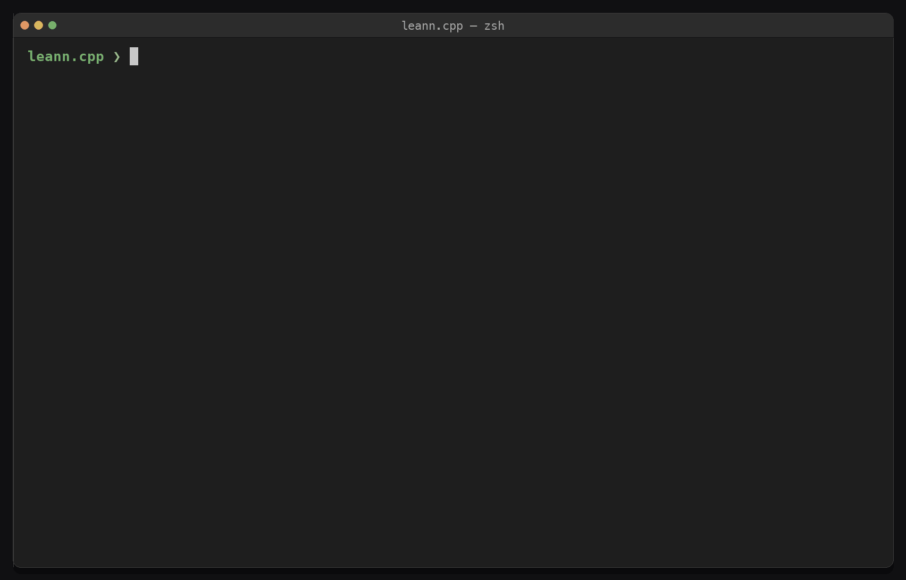

# leann.cpp

`leann.cpp` is a native C++20 spike for low-storage local RAG. It builds an
HNSW graph with hnswlib, discards the dense vectors, stores a pruned CSR graph
plus trained product-quantization (PQ) codes, and recomputes promising document
embeddings in batches with a GGUF model through a pinned llama.cpp/ggml C API.

This repository is an independent LEANN-style implementation, not an
accuracy-compatible port of official LEANN. Official LEANN has a Python
control plane and a custom FAISS C++ data plane; this project targets a
zero-Python, single-process C++/ggml deployment. The `v0.3` development line
added fail-closed artifact integrity to the measured `v0.2` retrieval spike,
and the current `v0.4` line makes the tool operable: strict option handling,
structured output, cancellable builds, and artifact recovery. The question
underneath has not changed:

> Can a llama.cpp embedding model traverse a compact graph by selectively
> recomputing document embeddings, and what recall/latency/storage trade-off
> does that produce?

## Demo

`leann build` → `leann search` → `leann stats`, end to end with the built-in
deterministic hash embedder (no model download, no Python service). The dense
document vectors are discarded, yet the compact index still answers the query
and reports exactly what it kept on disk:



Reproduce it with the [hash-backend quick start](#quick-start) below.

## What works

- Native C++ runtime with no Python service.
- GGUF embedding through the current llama.cpp C API.
- HNSW construction through hnswlib.
- High-degree-preserving base-graph pruning plus compact upper HNSW layers.
- Trained, bit-packed PQ with asymmetric distance computation (ADC); SimHash
  remains available as an ablation.
- Greedy upper-layer routing, graph beam search for large indexes, and flat ADC
  for small local indexes.
- Exact llama.cpp recomputation and ranking of only the selected candidates.
- Batched on-demand recomputation.
- A non-cryptographic model/config fingerprint guardrail.
- A self-describing artifact: the index records which GGUF built it, that
  file's SHA-256, and the document/query prefixes it must be searched with, so
  a downloaded pair names what it needs instead of only failing a comparison.
- SHA-256-protected indexes, lazy per-chunk CRC32C document validation, shared
  corpus identity, and fail-closed pair publication.
- Fail-fast rejection of non-finite configuration, query, embedding, PQ, and
  cosine-distance values before they can enter integer conversions or ranking.
- Const, mutex-protected document reads so one immutable index/document pair
  can serve concurrent searches.
- A versioned, dependency-free C11 read/search API with opaque handles,
  caller-owned batched embedding callbacks, owned result bytes, and
  thread-local errors.
- `build`, `search`, `stats`, exact-ground-truth `bench`, `doctor`, `pull`, and
  `verify` commands, including a same-embedding dense HNSW baseline.
- Strict per-command option validation with correction hints, per-command
  help, and opt-in `--format json` on every command. See
  [the CLI guide](docs/CLI.md).
- Cancellable builds: SIGINT unwinds without publishing and without leaking
  locks or temporaries, and exits 130.
- Reproducible BEIR SciFact preparation and parameter-sweep scripts.
- Deterministic hash embedder for fast development and CI.

## Build

The default build fetches a pinned hnswlib revision:

```bash
cmake -S . -B build -DCMAKE_BUILD_TYPE=Release
cmake --build build -j
ctest --test-dir build --output-on-failure
```

Enable the native llama.cpp backend with an existing checkout:

```bash
cmake -S . -B build-llama \
  -DCMAKE_BUILD_TYPE=Release \
  -DLEANN_ENABLE_LLAMA=ON \
  -DLEANN_LLAMA_CPP_SOURCE_DIR=/path/to/llama.cpp
cmake --build build-llama -j
```

If `LEANN_LLAMA_CPP_SOURCE_DIR` is omitted, CMake fetches a pinned llama.cpp
revision. On macOS, the llama.cpp defaults provide the ggml Metal backend; on
other platforms, use the usual llama.cpp CMake backend flags.

For environments without CMake, the developer Makefile can build the
non-llama path:

```bash
make HNSWLIB_DIR=/path/to/hnswlib
make HNSWLIB_DIR=/path/to/hnswlib \
  test persistence-test core-safety-test c-api-test
```

## Quick start

Input is UTF-8 text with one already-chunked document per non-empty line.
Build and query with one GGUF embedding model:

```bash
./build-llama/leann build \
  --docs samples/documents.txt \
  --index out/demo \
  --embedder llama \
  --model /path/to/embedding-model.gguf \
  --approx pq \
  --pq-subquantizers 64 \
  --pq-bits 4

./build-llama/leann search \
  --index out/demo \
  --query "How can compact vector search save disk space?" \
  --embedder llama \
  --model /path/to/embedding-model.gguf \
  --top-k 3 \
  --ef-search 64 \
  --rerank-ratio 0.25
```

The same model description/size, pooling metadata, and `--gpu-layers` setting
must be used for build and search. This guardrail catches common configuration
mismatches, but it does not identify the llama.cpp build or the
Metal/CUDA/Vulkan backend. The index separately **records** the SHA-256 of the
GGUF file it was built from, which is what lets a downloaded copy be checked —
but that digest is metadata, not an enforced check: nothing verifies that the
model actually in use hashes to it.
`--ctx` is the token capacity per document sequence; `--parallel` sequences
share a llama.cpp context sized as their product.
`--pq-subquantizers` must evenly divide the embedding dimension. The default
64 works with common 384-, 512-, 768-, 1024-, and 1536-dimensional models.

Use the hash backend to exercise the complete pipeline without a model:

```bash
./build/leann build \
  --docs samples/documents.txt \
  --index out/demo-hash \
  --embedder hash \
  --hash-dim 256

./build/leann search \
  --index out/demo-hash \
  --query "local vector index storage" \
  --embedder hash \
  --hash-dim 256
```

`leann --help` lists the commands, `leann <command> --help` prints one
command's options, and `leann --version` prints the version. An option a
command does not read is an error rather than a silently ignored token:

```console
$ leann search --index out/demo-hash --query cat --topk 2
error: unknown option for leann search: --topk; did you mean --top-k?
```

Add `--format json` to any command for a single machine-readable object on
stdout; the default text output is unchanged. Long builds accept
`--progress auto|always|never` and are cancellable with Ctrl-C, which
publishes nothing and leaves no temporaries behind. After an interrupted or
failed build, `leann doctor --index PREFIX` reports what is on disk and
`--repair` removes what is provably safe to remove. The details, including
what `doctor` deliberately refuses to do, are in [the CLI guide](docs/CLI.md).

## Embed with the C API

Native applications can open an existing artifact pair and search it without
starting the CLI or giving leann.cpp ownership of their model. Include
`<leann/leann.h>`, provide a `leann_embed_batch_fn`, then use the opaque
`leann_searcher` and `leann_results` handles:

```c
leann_embedder_v1 embedder = {
    sizeof(leann_embedder_v1),
    LEANN_C_API_VERSION,
    app_session,
    768,
    {fingerprint, fingerprint_size},
    app_embed_batch,
};
leann_searcher * searcher = NULL;
leann_status status =
    leann_searcher_open("out/demo", &embedder, &searcher);
```

The ABI is read/search-only and independent of llama.cpp types. It validates
the artifact pair, dimension, and fingerprint before invoking the callback;
calls into one callback are serialized for non-reentrant model sessions. See
[the C API guide](docs/C_API.md) for the complete lifecycle, ownership rules,
status handling, and a C11 example.

For large repeatable builds, normalized embeddings can be streamed from an
exact-source-bound cache without loading a GGUF model in the builder:

```bash
./build/leann build \
  --docs work/datasets/nq/documents.txt \
  --index out/nq \
  --embedder cache \
  --embedding-cache work/datasets/nq/model.leannbc2
```

`LEANNBC2` caches use this little-endian layout: the eight-byte
`LEANNBC2` magic; `uint32` dimension; `uint64` row count; `uint32`
fingerprint length; `uint64` exact source-document file size; the raw 32-byte
SHA-256 of that file; the fingerprint bytes; then row-major normalized FP32
vectors. The builder verifies the exact `--docs` bytes, declared shape, and
cache length before building, streams vectors in build batches, and persists
the cache's original embedder fingerprint. `LEANNBC2` does not contain its own
payload or model digest, so it should not be treated as a self-authenticating
artifact. The large-scale benchmark orchestrator and collector separately
SHA-256-attest the cache bytes, model artifact, and ground-truth bindings.
`cache` is deliberately rejected by `search` and `bench`; queries must use the
real matching embedder.

## Benchmark

`bench` computes dense exact ground truth in memory, then reports recall,
latency, and recomputation counts for the compact index. It can also build a
dense HNSW from the identical normalized embeddings:

```bash
./build-llama/leann bench \
  --index out/demo \
  --queries samples/queries.txt \
  --embedder llama \
  --model /path/to/embedding-model.gguf \
  --top-k 3 \
  --ef-search 64 \
  --recompute-batch 16 \
  --rerank-ratio 0.25 \
  --dense-baseline 1 \
  --ground-truth-cache out/demo.bench.f32
```

The optional cache is a benchmark-only artifact; it is never loaded by
`search` and is not part of the low-storage index.

At large scale, pass precomputed exact neighbors with `--ground-truth FILE`
and leave `--dense-baseline 0` to skip corpus embedding and the in-process
exact scan. The text format is:

```text
LEANN_GT1 <query-count> <k> <corpus-count>
<id-0> <id-1> ... <id-k-1>
... exactly one row per selected query
```

IDs are decimal zero-based document IDs. The standalone loader structurally
validates the file and requires its header to match the complete query file
and index corpus size before any `--max-queries` prefix is selected. Its
encoded `k` must be
at least `--top-k`; wider truth files are reused by taking each row's first
requested IDs. Every row must contain exactly its encoded `k` in-range,
non-duplicate IDs. Blank lines are ignored. Legacy `LEANNBC1` files remain
supported by `--ground-truth-cache`. For published benchmark evidence, the
orchestrator and collector additionally SHA-256-attest the truth, query-cache,
corpus-cache, and model artifacts.

Use `--query-embedding-cache FILE` to make different implementations consume
identical precomputed query vectors. This is an exact-source-bound `LEANNBC2`
cache whose source size and SHA-256 must match the exact `--queries` file.
Its fingerprint and dimension must also match both the loaded index and the
real query embedder. The cache supplies only query vectors: leann.cpp keeps
the real llama.cpp embedder loaded for candidate recomputation.

`bench` runs one unmeasured prefix query by default; set
`--warmup-queries 0` to disable it or choose a larger prefix. Warmup searches
do not contribute to recall, latency, or candidate counters. For durable raw
observations, `--raw-latencies FILE` writes one CSV row per measured query
with recall, compact-index latency, exact recomputations, approximate
distances, upper-layer hops, embedding batches, and optional dense-HNSW
latency/recall. Its final `result_ids` column records exactly `top-k` ranked
decimal IDs separated by one ASCII space so a collector can independently
recompute recall. The file is written to a same-directory temporary file,
flushed, and atomically published only after all measured queries succeed.
Warmup rows are never written.

One wider search can report two recall cutoffs. For example,
`--top-k 10 --report-k 3` performs only the top-10 retrieval and reports both
`recall_at_10` and prefix `recall_at_3`, using the first three returned IDs
against the first three exact IDs. The raw CSV gains a `recall_at_3` column
only when this option is present. `--report-k` must be positive and no larger
than `--top-k`; omitting it preserves the original output schema.

### Publication-scale comparison workflow

The large-scale harness prepares deterministic, nested 100K and 1M Natural
Questions tiers and compares leann.cpp with the pinned official LEANN runtime.
It is intentionally fail-closed: a publication report is rejected when a
required sweep point, exact repetition, artifact hash, imported Python/FAISS
module, native embedding-parity check, live llama-server process attestation,
or ranked result ID is missing or inconsistent.

The workflow is split into resumable tools:

1. `prepare_beir_nq_scale.py` verifies and prepares the source archive,
   document-ID mappings, exact tier prefixes, and dataset manifest.
2. `run_large_scale_benchmark.py prepare` creates exact-source-bound corpus and
   query caches plus blockwise exact top-k truth. `orchestrate` records an
   explicit `--native-role gate` or `sweep`, exact warmup/repetition counts,
   materialized commands, raw per-query results, runtime identity, and artifact
   hashes.
3. `validate_embedding_parity.py` independently compares native in-process
   llama.cpp embeddings with the exact vectors consumed by official LEANN.
4. `attest_embedding_endpoint.py capture` binds the live embedding endpoint to
   its server process, executable, GGUF, build, and active cache checkpoint;
   `finalize` binds that capture to the post-run parity evidence.
5. `collect_large_scale_results.py` reopens and hashes the evidence, recomputes
   parity and Recall@k independently, enforces the complete profile matrix, and
   atomically publishes JSON, Markdown, and CSV outputs.

Inspect each entry point before launching an expensive run:

```bash
python3 scripts/prepare_beir_nq_scale.py --help
python3 scripts/run_large_scale_benchmark.py prepare --help
python3 scripts/run_large_scale_benchmark.py orchestrate --help
python3 scripts/validate_embedding_parity.py --help
python3 scripts/attest_embedding_endpoint.py capture --help
python3 scripts/attest_embedding_endpoint.py finalize --help
python3 scripts/collect_large_scale_results.py --help
python3 scripts/chunk_corpus.py --help
python3 scripts/publish_hf_index.py pack --help
python3 scripts/publish_hf_index.py push --help
```

For the final two-tier publication, pass every native, official-cached, and
official-real manifest for both tiers, one parity report per tier, and one
finalized endpoint attestation per tier:

```bash
python3 scripts/collect_large_scale_results.py \
  --manifest 100k=work/bench-nq/100k/native/manifest.json \
  --manifest 100k=work/bench-nq/100k/official-cached/manifest.json \
  --manifest 100k=work/bench-nq/100k/official-real/manifest.json \
  --manifest 1m=work/bench-nq/1m/native/manifest.json \
  --manifest 1m=work/bench-nq/1m/official-cached/manifest.json \
  --manifest 1m=work/bench-nq/1m/official-real/manifest.json \
  --parity 100k=work/bench-nq/100k/parity.json \
  --parity 1m=work/bench-nq/1m/parity.json \
  --endpoint-attestation 100k=work/bench-nq/100k/endpoint-attestation.json \
  --endpoint-attestation 1m=work/bench-nq/1m/endpoint-attestation.json \
  --required-tier 100k \
  --required-tier 1m \
  --output-prefix outputs/nq-scale
```

The collector never fills missing points with estimates. Use
`--allow-incomplete` only for an explicitly labeled development report; do not
use it for published comparisons.

Prepare the public BEIR SciFact corpus and run a repeatable sweep:

```bash
python3 scripts/prepare_beir_scifact.py --output work/datasets/scifact

python3 scripts/run_sweep.py \
  --binary build-llama/leann \
  --index pq64=out/scifact \
  --queries work/datasets/scifact/queries-test.txt \
  --embedder llama \
  --model /path/to/embedding-model.gguf \
  --ground-truth-cache work/datasets/scifact/model.bench.f32 \
  --ef-search 32,64,96 \
  --dense-baseline \
  --output out/sweep
```

Sweep at least these knobs:

| Knob | Storage | Recall | Latency |
|---|---:|---:|---:|
| `--low-degree` down | lower | usually lower | can fall or rise |
| `--pq-subquantizers` up | higher code bytes | usually higher | nearly neutral |
| `--pq-bits` up | higher codebook/codes | usually higher | nearly neutral |
| `--ef-search` up | unchanged | higher | higher |
| `--rerank-ratio` down | unchanged | wider approximate beam | slightly higher |
| `--recompute-batch` up | unchanged | neutral/slightly changed | model-dependent |
| `--scan-limit` up | unchanged | can improve small-index recall | more ADC work |

`search_ms` excludes the one query-embedding call but includes document reads,
document embedding recomputation, graph traversal, and exact ranking.

### Official LEANN baseline

The reproducible SciFact comparison pins
[StarTrail-org/LEANN](https://github.com/StarTrail-org/LEANN) at commit
`7a34d88`, uses the same Nomic GGUF corpus vectors, and matches recall before
comparing candidate counts and latency.

| Metric | leann.cpp v0.2 | Official LEANN |
|---|---:|---:|
| Vector index | 385,975 B | 635,358 B |
| Vector-serving artifacts | 385,975 B | 721,992 B |
| Total storage including text | 8,210,103 B | 8,788,218 B |
| Recall@3, all 300 queries | 0.924444 | 0.927778 |
| Candidate embeddings/query | 64.00 | 307.81 |
| Mean real-GGUF latency | 1,273.827 ms | 6,534.278 ms |
| P50 real-GGUF latency | 1,196.477 ms | 6,372.138 ms |
| P95 real-GGUF latency | 1,750.226 ms | 8,642.614 ms |

At nearly identical recall, leann.cpp's vector index is 39.25% smaller and it
uses 4.81 times fewer embedding recomputations. Its measured real-GGUF mean
latency is 5.13 times lower. Official LEANN is nevertheless much more mature:
its Python control plane and custom FAISS C++ data plane support ingestion,
MCP, filtering, hybrid/BM25 retrieval, and multiple graph backends.

Official recall and candidate counts use all 300 queries with the exact shared
corpus vectors. Official real-GGUF latency uses 20 evenly spaced queries
through its supported ZMQ/OpenAI-compatible path to llama-server; leann.cpp
latency uses all 300 queries with llama.cpp in-process. Both timers exclude
query embedding and cold start, so the latency ratio is a directional
experimental result rather than a formal confidence bound.

The result supports positioning leann.cpp as a **zero-Python, single-process
selective-recomputation index with in-process llama.cpp/ggml**, not as the
first C++ implementation of LEANN. See
[the complete comparison](outputs/official-leann-comparison.md) and its
[machine-readable metrics](outputs/official-leann-comparison.json) for timing
scope and caveats.

## Runtime artifacts

For prefix `out/demo`, the builder writes:

- `out/demo.leann`: corpus identity, embedder fingerprint, pruned CSR graph,
  compact upper layers, PQ/SimHash data, and a full-file SHA-256 footer.
- `out/demo.docs`: corpus identity, offsets, per-chunk CRC32C values, a
  SHA-256-protected metadata region, and raw chunk bytes.

No FP32 document embedding is written. Run `leann stats --index out/demo` to
compare index bytes with raw document bytes and the omitted dense-vector size.

### Artifact integrity and format migration

The `.leann` v4 and `.docs` v2 formats deliberately reject older spike
artifacts. A `LEANNC03` index is recognised by magic and rejected with a
message naming the boundary rather than reported as "not a leann.cpp index";
there is no in-place upgrade, because the embedder descriptor and the prefixes
it added are load-bearing for search. Rebuild a v3 pair from its source
chunks. Both new artifacts
carry the same deterministic 256-bit identity derived from ordered chunk
lengths and bytes. `search`, `bench`, and `stats` reject a mixed pair before
query embedding or corpus scanning.

Index loading verifies SHA-256 over the complete compact index. Opening a
document store verifies only its header, offset table, and checksum table, so a
100 GB raw corpus is not scanned at startup. Each fetched chunk is checked
against CRC32C before it is returned for recomputation.

Builders acquire adjacent `.lock` directories, use unique temporary and backup
names, validate both completed artifacts, publish the document store, and
rename the index last as the commit marker. An ordinary failure rolls back to
the previous pair; interruption can leave the index absent or a stale lock,
but never makes a mixed pair pass validation. C++20 has no portable fsync or
two-file atomic rename, so this is fail-closed publication rather than a
power-loss atomicity claim. After a machine-level interruption, stop all
builders and inspect any `.bak.*` artifacts before removing a stale lock.
If the new pair commits but backup/lock cleanup fails, `build` reports that
distinct committed state and retains the recoverable path instead of silently
claiming cleanup success.

### Shareable indexes

Because the dense vectors are discarded, a leann.cpp index is small enough to
hand to somebody else. That only works if the artifact says what it needs, so
the `.leann` header carries an embedder descriptor: the model's origin string,
the SHA-256 and size of the GGUF file used at build time, its pooling mode and
context budget, the document and query prefixes, and a free-form artifact card
of publisher key/value pairs.

The prefixes are applied by `Index` itself at all three embedding sites, so a
downloaded pair is queried the way its publisher built it without the caller
knowing anything. They never reach the document store, so a search result is
the chunk rather than the chunk with a prompt glued to it.

```console
$ leann build --docs corpus.txt --index corpus \
    --embedder llama --model nomic-embed-text-v1.5.Q4_K_M.gguf --ctx 1280 \
    --model-source 'hf:nomic-ai/nomic-embed-text-v1.5-GGUF/nomic-embed-text-v1.5.Q4_K_M.gguf' \
    --document-prefix 'search_document: ' --query-prefix 'search_query: ' \
    --card license=apache-2.0 --card corpus='what this is'
$ python3 scripts/publish_hf_index.py pack --index corpus \
    --output upload --repo OWNER/NAME --leann ./leann
$ HF_TOKEN=... python3 scripts/publish_hf_index.py push \
    --directory upload --repo OWNER/NAME --create-repo --yes
```

On the other side, `leann pull` prints the exact `curl` commands and the
digests they must produce, and `leann verify` checks what landed:

```console
$ leann pull hf:OWNER/NAME --manifest leann.manifest
$ leann verify --index corpus --manifest leann.manifest
```

`pull` opens no socket. That is what keeps the binary free of an HTTP client
and a TLS dependency, and it is also exactly why `pull` alone establishes
nothing: `verify` is the step that checks anything. See
[docs/CLI.md](docs/CLI.md) for the `LEANNMF1` manifest grammar and
[docs/PUBLISHING.md](docs/PUBLISHING.md) for the end-to-end walkthrough.

Like `LEANNBC2`, a manifest is not self-authenticating. It is unsigned, there
is no trust root and no revocation, and its digests are only as trustworthy as
the channel that delivered it. A match establishes that the bytes are the ones
the publisher recorded — not that the publisher is trustworthy, and not that
the index retrieves well.

### Concurrency and numeric safety

`Index` is immutable after loading, and `DocumentStore::read` /
`DocumentStore::read_many` are const and serialize access to their shared file
stream. Multiple search workers can therefore share one loaded index/document
pair. Moving or destroying that pair while reads are active is unsupported.
Each worker must use its own `Embedder`, or an embedder implementation that
explicitly guarantees concurrent calls; the generic embedder interface does
not add hidden serialization.

Library validation rejects NaN and infinity in build/search ratios, raw query
vectors, backend embeddings, PQ calculations, and exact cosine ranking.
Positive but extremely small rerank ratios saturate the approximate beam at the
index size instead of converting an infinite intermediate to an integer.

## Honest spike boundaries

The implementation now has trained PQ and retained upper routing layers, but
it is still a research spike rather than the paper's complete system:

- all dense embeddings remain in RAM during build;
- PQ training is ordinary per-subspace Lloyd k-means, without OPQ/residual PQ;
- graph pruning selects from existing HNSW neighbors rather than performing
  reconstruction search;
- flat ADC is intentionally used below `--scan-limit` (100k nodes by default);
- a line-oriented document store with no deletes or incremental updates;
- no automatic recovery command yet for stale locks/backups after a
  machine-level interruption;
- no bundled service mode, cancellation, or request scheduler.

The shareable-index work has its own boundaries, and they are not small:

- `leann pull` prints commands and opens no socket, so the binary fetches
  nothing, retries nothing, and verifies nothing until `verify` runs;
- a `LEANNMF1` manifest is unsigned, with no trust root and no revocation;
- a matching digest proves the bytes are the ones the publisher recorded, not
  that the publisher is trustworthy or that the index is any good;
- the recorded model SHA-256 is metadata the loader does not enforce, and the
  recorded context-token budget is not checked against the live embedder;
- a recorded artifact digest pins one build, not one corpus: embeddings are
  not bit-identical across backends or batch shapes, so rebuilding the same
  chunks elsewhere yields a valid index with different bytes;
- `scripts/publish_hf_index.py pack` is exercised by tests; its `push` path has
  not been run against the live Hugging Face API from this repository.

Those differences matter. Do not claim the paper's “under 5%” or recall/latency
numbers from this code without measuring them on the target corpus and model.
See [DESIGN.md](DESIGN.md), [VALIDATION.md](VALIDATION.md), and
[ROADMAP.md](ROADMAP.md).

## References

- Y. Wang et al., [LEANN: A Low-Storage Vector
  Index](https://arxiv.org/abs/2506.08276), MLSys 2026.
- [StarTrail-org/LEANN](https://github.com/StarTrail-org/LEANN), official
  Python control plane and custom native backends.
- [ggml-org/llama.cpp](https://github.com/ggml-org/llama.cpp).
- [nmslib/hnswlib](https://github.com/nmslib/hnswlib).

## License

MIT. Dependencies retain their own licenses.
